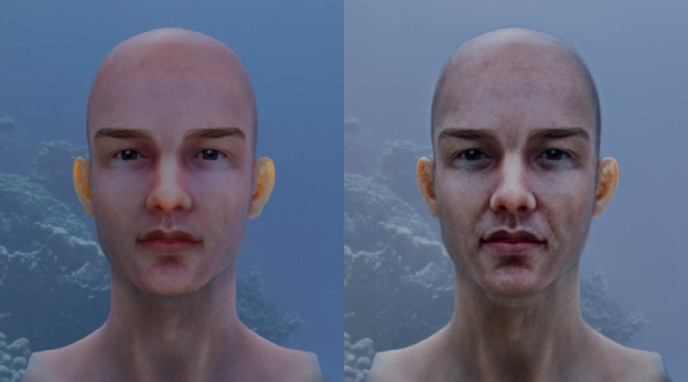
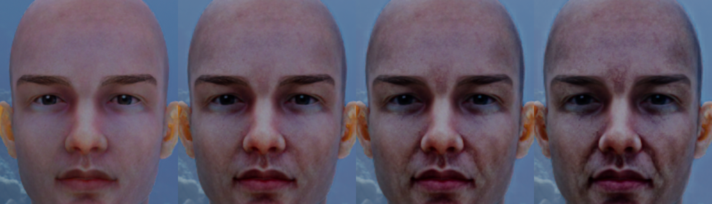
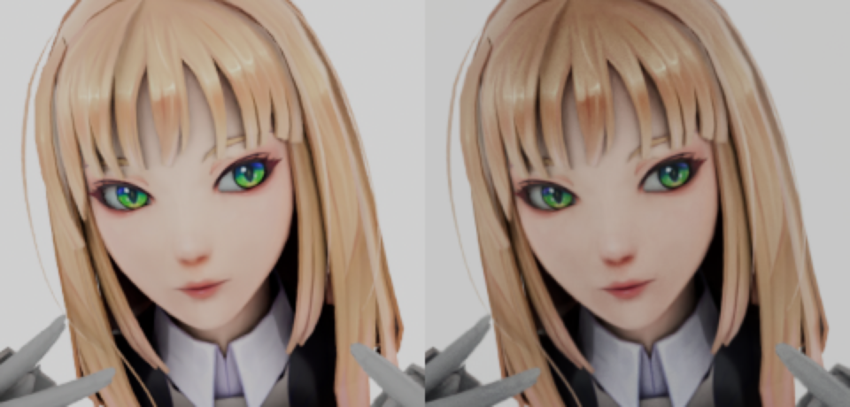
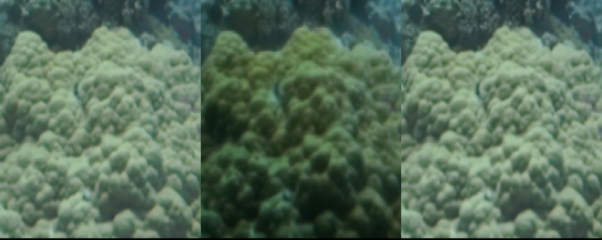
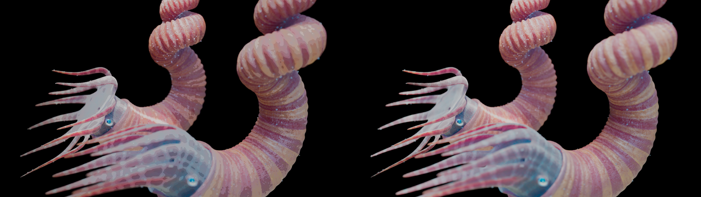

# DLSS5 Arnold!

**DLSS 5 neural rendering for Arnold renders in Maya 2024**



*Left: Arnold render. Right: the same frame after DLSS 5 neural rendering (strength 0.98, 2 passes, +0.75 exposure), same resolution.*

**Passes:** original, then 1, 2 and 3 passes. 2 is the sweet spot; 3 starts to age the face.



**Stylised characters** get pulled toward photoreal too (strength 0.98, 1 pass):



Runs NVIDIA's **DLSS 5 neural rendering** (NGX feature 18, the "photoreal" pass) on **Arnold renders from Maya**. Output is the **same resolution** as the input; nothing is upscaled.
As far as we know, this is the **first DLSS 5 tool for Maya/Arnold**, and the first to feed the model the renderer's **real depth and exact motion vectors** in **16-bit linear (ACES)**. Other DLSS 5 image/video tools work from flat images; see *Related projects*.


- **What it's good at:** photoreal re-rendering of **characters and faces**. Skin, eyes and lips get the same transformation you see in games that use DLSS 5.
- **What it's not:** a general detail enhancer. On environments and props it applies a mild relight and softens the image slightly. See [Docs/TEST_RESULTS.md](Docs/TEST_RESULTS.md) for the measurements.
- **Status:** experimental proof of concept. Unofficial, and not supported by NVIDIA.

## How it works

```
Maya scene --(export .ass.gz, + Z AOV, + motionvector AOV)--> Arnold kick --> linear EXR
   EXR --(ACEScg -> scRGB, depth -> reversed-Z, motion vectors -> delta UV)--> dlss5_host.exe
   dlss5_host.exe = tiny D3D11 app + ReShade add-on:
        ReShade + dlss5-feed + renodx-dlss5 (your own install) run DLSS/DLAA + DLSS 5 NR on it
   result (16-bit float) --(stabilise along motion vectors, restore out-of-gamut)--> EXR / PNG16 / PNG8
```

Maya never loads ReShade. The DLSS work happens in a separate helper process (`runtime/dlss5_host.exe`), so a crash there can't take Maya down.

## Requirements

- Windows 10/11, an **NVIDIA RTX GPU** that runs the DLSS 5 NR runtime (tested on an RTX 2080 SUPER, driver 616.56)
- Maya 2024 + MtoA (Arnold 7.3)
- A working **DLSS 5 ReShade setup from a game**. This repo does **not** include it (see below).
- To build the helper: Visual Studio 2022 Build Tools (MSVC v143) + Windows 11 SDK

## Setup

1. **Build the helper.** Run `host\build.bat`, which writes `runtime\dlss5_host.exe`. See [Docs/BUILD.md](Docs/BUILD.md).
2. **Copy your own DLSS 5 runtime into `runtime\`.** These files are *not* included (proprietary or third-party). To get them, **download a DLSS 5 wrapper**: the DLSS5-Feeder + RenoDX DLSS5 setup people use to run DLSS 5 in games. Copy these files from it:

   | File | From |
   |---|---|
   | `dxgi.dll` | ReShade 6.8 (with add-on support) |
   | `dlss5-feed.addon64`, `dlss5-feed.cfg` | DLSS5-Feeder |
   | `renodx-dlss5.addon64` | RenoDX DLSS5 |
   | `dlss5-lab-overlay-*.addon64` | optional |
   | `nvngx_dlss.dll`, `nvngx_dlssnr.dll` | NVIDIA DLSS / DLSS 5 NR runtime (310.x) |
   | `reshade-shaders\Shaders\DLSS5_Feed.fx`, `ReShade.fxh`, `ReShadeUI.fxh` | DLSS5-Feeder / ReShade |

   Then start from `runtime\ReShade.ini.template` and `runtime\ReShadePreset.ini.template` (rename them to drop `.template`).
3. **Add the Maya shelf.** Paste `maya\install_shelf.py` into Maya's Script Editor (Python tab) once, or add it to your `userSetup.py`.

## Using it (DLSS5 shelf)

| Button | Does |
|---|---|
| **Panel** | Strength, Structure, Style, output folder, output format, stabilisation, frame range, EXR sequence |
| **Render** | The current frame: Arnold (its own live progressive render window) → DLSS 5 → Render View. Writes a 16-bit PNG. |
| **Seq** | Pick any frame of a rendered EXR sequence (with a `Z` AOV) → DLSS 5 on the whole sequence |
| **Out** | Opens `<project>/images/dlss5` |

- **Live preview:** a single frame (Panel's "Process Current Frame" or the shelf's Render button) shows Arnold's own progressive render window as it renders - buckets filling in live - before DLSS 5 runs and the result replaces it in the Render View. Frame ranges/sequences render silently (no popup per frame).
- **Strength:** 0.25 keeps a stylised character's design and adds realistic skin. 0.98 is a full photoreal re-interpretation.
- **Preset:** a starting point for every slider below it - built-in (*Default (safe)*, *Subtle*, *Faces - photoreal*, *Surfaces - crisp*, *Full DLSS 5 look*, *Environments / props*) or your own, saved with **Save** and removed with **Del**. **Reset** always returns to the safe defaults. All Panel settings are remembered between sessions and shared with the shelf's Render/Seq buttons.
- **Compress before DLSS** (on in the *Environments / props* preset, off by default elsewhere): DLSS 5 was trained on tonemapped game frames, not raw scene-linear render passes - Arnold's true shadow depth sits outside what it expects, and it compensates in a way that reads as crushed blacks. This tone-compresses the scRGB buffer the same way Hill's ACES fit compresses for display, and exactly inverts it afterwards, so nothing is lost - full 16-bit float precision and extended range are kept throughout, only the statistics DLSS 5 sees are changed:

  

  *Measured on this shot: the default (unchecked) darkened the whole image ~44% and crushed the shadow level from 0.25 to 0.09; with Compress before DLSS on it landed at 0.44 and 0.22 - matching Arnold almost exactly, with no clipping or quantisation (8600+ distinct shadow levels survive). Try it first on anything that isn't a face.*
- **Linear HDR input** (on by default - advanced, leave this on and use Compress before DLSS above instead): off falls back to an older, cruder fix that also matches DLSS 5's expected input, but by feeding it Arnold's already view-transformed **8-bit** PNG instead - genuinely clipping extended-range colour and quantising to 256 levels before DLSS 5 even sees it.
- **Look amount** (0-1) and **Detail amount** (0-3): our own version of DLSS 5's Tone/Structure pair, not capped by the model. Look 0 keeps Arnold's own lighting, colour and SSS and takes only DLSS 5's fine detail (pores, creases, stubble) - this avoids the "game character / photogrammetry scan" look and replaces the old Full/Detail-only mode switch. Detail above 1 amplifies DLSS 5's own fine detail beyond its Structure cap. **Detail size** 3 px is recommended.
- **Keep out-of-focus areas as Arnold's own render** (on by default): DLSS 5 posterises smooth depth-of-field blur into flat, cel-shaded patches instead of keeping it soft. Using the render camera's own focus distance and aperture (needs **Enable DOF** on that camera) plus the Z-depth pass, this falls back to Arnold's own pixels wherever a pixel is genuinely out of focus, feathered so there's no visible seam. Does nothing if the camera has no depth of field, or on an already-rendered EXR sequence (no live camera to read).
- **Show result in a viewer window:** opens the result in FCheck when done (sequences play). It stays open and is remembered between sessions.
- **Passes** (1–3): runs DLSS 5 again on its own output. **2 is the strong setting** on faces (visible pores, stubble, deeper form). 3 overcooks: faces age and drift from the design, and environments soften more.
- **Exposure** (−2 to +2 stops): brightens or darkens the DLSS 5 output, applied after the DLSS pass; the saved original Arnold reference PNG is left untouched. Extra passes darken faces slightly, and +0.5 to +1 compensates.
- **Frame ranges** use Arnold's exact motion vectors plus temporal stabilisation, which gives about 30% less "wobble" on faces.
- **Output:** Auto (single frame → PNG 16-bit, ranges → half-float EXR in the rendering space + 8-bit preview), or EXR / PNG16 / PNG8. PNGs carry an embedded sRGB profile so they open correctly (not washed out) in colour-managed apps like Photoshop.
- **Debug images** (Panel checkbox, off by default): per frame, `compare` (original | DLSS 5), `diff` (where DLSS 5 changed things locally, with the overall colour shift removed) and `inputs` (what DLSS 5 received: colour | depth | motion vectors). They're written to `output/debug`.
- **Settings sidecar:** every DLSS 5 result is saved with a small `.json` file next to it (same name, e.g. `shot_dlss5.0045.json`) recording every setting that produced it - Strength, Structure, Style, Passes, Look/Detail amount, Exposure, Linear HDR input, Compress before DLSS, DOF-aware - so an old render is self-documenting instead of relying on memory or the log.
- **Disk:** frames are processed in chunks sized to your free space, and temp files are deleted per frame.

**Depth of field, before/after "Keep out-of-focus areas":**



*Left: DLSS 5 on its own turns the smooth defocus blur into flat, cel-shaded patches. Right: the same frame with the depth-based focus mask, using the camera's real focus distance/aperture from the Z-depth pass - the out-of-focus tentacles and background coils fall back to Arnold's own pixels, feathered, while the in-focus shell is untouched.*

## Batch / render farm

The helper must open a window on the GPU. It works from `mayapy` or from a Deadline Worker running **in a logged-in desktop session**, but **not** from a Worker running as a Windows service (session 0). Scripting API: `dlss5_enhance.process_scene_frames(...)`, `process_exr_sequence(...)`.

## Docs

- [Docs/DLSS5_ENHANCED_DETAIL_ANALYSIS.md](Docs/DLSS5_ENHANCED_DETAIL_ANALYSIS.md): what the DLSS 5 stack is and why this design
- [Docs/MAYA_ARNOLD_INTEGRATION.md](Docs/MAYA_ARNOLD_INTEGRATION.md): pipeline details
- [Docs/INPUT_REQUIREMENTS.md](Docs/INPUT_REQUIREMENTS.md): colour, depth and motion-vector contract
- [Docs/BUILD.md](Docs/BUILD.md): building the helper
- [Docs/TEST_RESULTS.md](Docs/TEST_RESULTS.md): all measurements

## Related projects

Other tools that run DLSS 5 neural rendering outside games (image/video, from flat frames):
- [Merserk/dlss5-visual-enhancer](https://github.com/Merserk/dlss5-visual-enhancer): images and video app
- [Blueforcer/ComfyUI-DLSS5-Enhancer](https://github.com/Blueforcer/ComfyUI-DLSS5-Enhancer): ComfyUI nodes
- [RH-RunningHub/ComfyUI-RH-DLSS5](https://github.com/RH-RunningHub/ComfyUI-RH-DLSS5): ComfyUI nodes
- [NIGos/dlss5-bridge](https://github.com/NIGos/dlss5-bridge), [faisalkindi/DLSS5oneclick](https://github.com/faisalkindi/DLSS5oneclick): game setups

What this project adds: it sits inside the Maya/Arnold render, and it uses real render depth and exact Arnold
motion vectors instead of estimated optical flow. It works in 16-bit linear with ACES (keeping out-of-gamut colour),
with stabilisation along the true motion, Detail-only mode, and measured results on CG content (Docs/TEST_RESULTS.md).

## Author

**Biscuit Beetle**: concept, direction, testing and all the art (the Arnold scenes, characters and ammonites used for the tests). Biscuit Beetle drove the key discoveries: that the effect lives in the character path, the Fallout 4 comparisons, and the 16-bit and wobble investigations.
Implementation was written with Claude (Anthropic) as a coding assistant.

## Licence and credits

The code in this repository is © Biscuit Beetle, released under the [MIT licence](LICENSE).
`host/third_party/reshade/include` holds the ReShade 6.8.0 add-on API headers (BSD-3-Clause OR MIT, © Patrick Mours; see their `LICENSE.md`).
DLSS, NGX and the DLSS 5 runtime are NVIDIA's. ReShade, DLSS5-Feeder, RenoDX and LumeniteFX belong to their respective authors. None of their binaries or shaders are included here.
